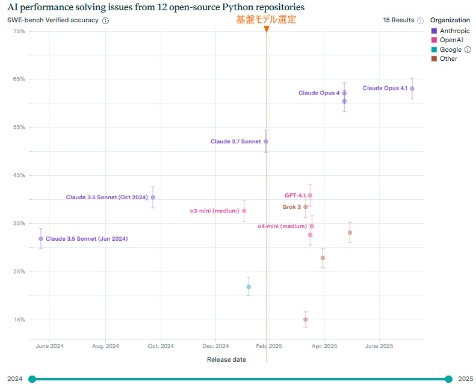

# IaCにおける生成AI活用の可能性

## 1.1. 背景・目的

クラウド推進部40期目標としてIaCの実装検証を行った。
2024年後半からの時代背景として生成AIを活用したシステム開発のためのツールが急速に発展していたため、
IaCの実装検証でもTerraformのコーディングに生成AIを活用することを検討した。

## 1.2. 検証内容

生成AIを使用してTerraformのコード生成を実施する。

- 使用する基盤モデル、開発ツールは公開されている活用事例や基盤モデルのベンチマークを参考にして選定する。
- コード生成のために生成AIに与える指示などを含む生成方法は、複数の方法を検証する。検証した方法をメリット、デメリットを評価する。  
  生成方法は、次の3ケースを想定する。
    - ① AWSの設計技術、Terraformコーディングの技術がある場合
    - ② AWSの設計技術のみある場合
    - ③ AWSの基礎知識のみある場合

## 1.3. 検証結果

### 1.3.1. 基盤モデル、ツールの選定結果

##### 開発ツール

Cursor

##### 基盤モデル

Claude Sonnet 3.7 

##### 生成方法の指針

選定した開発ツール、基盤モデルを使用する場合は以下の指針に従って生成を行う。

- コード生成指示プロンプトと同時に、設計書とコーディングルールを与える。
- コード生成は開始から完了までを一回の指示で実施する。
  - コード生成指示から作業タスクへの分割、生成完了までの反復実行は開発ツールにより自動で実行する。
- コード生成が失敗する場合はプロンプト、設計書、コーディングルールのいずれかを修正して再実行する。

### 1.3.2. 検証より得られた考察

##### 1.3.2.1. 開発プロセス

検証した3ケース全てにおいて、コードの生成からAWS上の環境生成完了までの開発プロセスは同一のプロセスになる。

以下に実施したプロセスを記載する。

- （1） 設計  
       想定ケース毎に担当者の技術に応じた設計書を作成する。  
       設計書の記載ルール、コーディングルールなどを作成する。
- （2） コード生成
       「(1) 設計」で作成した設計書とルールを与えて生成AIにTerraformのコードを生成させる。  
- （3） IaCコード解析、レビュー
        生成されたTerraformのコードをチェックして、改善箇所を指摘する。指摘がある場合は、設計書とルールを修正して「(2)コード生成」を再実行する。  
        Terraformのコードのチェックには以下の機能を使用する。
        - ① コード解析ツール
        - ② 生成AIによるレビュー
        - ③ 担当者によるレビュー
- （4） 構築
       Terraformのコマンドを実行してAWS上に環境を構築する。  
       生成AIはTerraformのコマンドを監視する。エラーが発生した場合はTerraformコードを修正してコマンドを再実行する。
- （5） 構築結果確認、動作検証
       担当者により、AWS上に構築された環境を目視確認と、システムの動作確認を行う。  
       不具合がある場合は設計書とルールを修正して「(2)コード生成」から再実行する。  

##### 1.3.2.2. 開発方法毎のメリット、デメリット

（考え中）

##### 1.3.2.3. 作業時間の短縮効果

- (1) Terraformのコーディングを行う作業時間は大幅に短縮される。
- (2) Terraformのコーディング以外の作業時間はほぼ増減なし。

##### 1.3.2.4. 品質に与える影響

- (1) 以下の効果により、メンテナンスしやすい設計が保たれるようになる。
    - ① 設計書を修正してTerraformコードを生成する手順が守られる。
    - ② 設計書修正から環境の再構築のサイクルが早い。

##### 1.3.2.4. 技術者の育成に与える影響

生成AIを活用してコード生成を行うと、Terraformの基礎学習を行わずともIaCを用いた学習プロセスが体験できる。

このことは、IaCに関する理解を促進するためには有効であるが、一方でTerraformに関する理解が不足したまま構築を行う危険がある。

対策として、開発リーダーによるメンバーの理解度のチェックを行う必要がある。

## 1.4. まとめ

IaCに生成AIを活用することで作業時間の短縮効果がある。また、技術者の育成にも一定の効果はあるが生成AIに依存するため必要な技術が習得できない危険がある。

生成AIの特徴をよく理解して使用することが重要となる。

## レポート内で使用する用語の解説

#### マルチモーダル

生成AIの入出力にテキスト以外にも画像や音声などを使用する機能。基盤モデルにより対応状況が異なるので使用する際には角煮ｎが必要。

#### エージェント、生成AIエージェント

ユーザーから与えられた指示に対して、達成するまでの作業を自動化する機能。必要なタスクへの分解をおこない、計画的にタスクを実行する。必要に応じて評価を行い指示が達成できるまで再実行する。

## 2. レポート全体の背景と目的

## 2.1. 背景

- 生成AIの進化により、IaCのコード生成が実務で利用可能な水準に近づいている一方で、IaC領域特有の課題（初回正答率の低さ、セキュリティ考慮不足、再現性の確保）が指摘されている（例：DPIaC-Eval）。
- 公平かつ再現可能な評価を行うためには、基盤モデルの選定基準と、ガードレールを備えたツールチェーンの定義が必要である。

## 2.2. 目的

- IaC の開発に生成AIを活用する際の「効果的な使用方法」を検証する。
- 生成AIを使用することの「有効性（どの程度有益か、どの条件で機能するか）」を検証する。
- 上記目的の達成のため、前提の異なるケース①〜③で比較検証を行う。

達成手段（検証設計の骨子）
- ベンチマークに基づく基盤モデル選定（DPIaC-Eval を最重視し、SWE-bench で最新性を補完）。
- IDE/静的解析/ポリシー/CI から成る最小ツールセット（ガードレール）の明確化。

## 2.3. 範囲と対象外

- 範囲: AWS を対象とした Terraform による IaC 構築、コード生成〜レビュー〜適用〜検証の工程。
- 対象外: 社内導入計画、投資効果（ROI）・費用対効果の算定、組織設計の検討。

## 2.4. 想定ケースの位置づけ

- ケース①: 人が Terraform のモジュール設計を実施し、AI がコードを自動生成。
- ケース②: 人が AWS の構成図と詳細設計を作成し、AI がコードを自動生成。
- ケース③: 人は基礎要件のみ提示し、AI と対話してサービス選定→コード自動生成。

## 2.5. 成果物と利用想定

- 生成コード、レビュー指摘と修正履歴、`plan/apply` ログ、セキュリティ検出結果。
- ケース横断の比較表（生産性・品質・セキュリティ・運用性）。
- 経営層への報告では技術的効果のサマリーのみ提示（導入/投資判断は範囲外）。

## 2.6. 評価方針（定性中心＋定量補助）

- 定性: 手動構築経験者によるレビュー（採用/要修正/不可）。
- 定量: 反復回数、作業時間、セキュリティ検出件数、`plan` の安定性などを参考指標として収集。

## 3. 使用する生成AI、ツールの選定

## 3.2. 生成AI基盤モデルの選定

IaCコードの生成を行うために適した基盤モデルを選定する。

選定にあたり、IaCの能力を測定するために適したベンチマークの選定を行い、ベンチマークの結果を参考にする。

## 3.3. プログラミング性能を比較する主要なベンチマーク

生成AIの性能を評価するベンチマークは多数存在する。ベンチマークの選定にあたりプログラミングの性能を測定するベンチマークを中心に評価を行う。
特にIaCコードを生成する能力を評価するベンチマークを重視する。

(1) **DPIaC-Eval** はIaCコードを生成する能力に特化して評価している。**DPIaC-Eval**の結果を最重視する。
(2) **DPIaC-Eval** は2025年1月が最終更新日となっている。**SWE-bench**は最新の基盤モデルが発表されるたびに即時更新されるため最新モデルの評価は**SWE-bench**を参考にする。

### 主要なベンチマークの概要

- **HumanEval**  
OpenAIが公開したプログラミング問題セット。AIが生成したコードが、指定されたテストケースをどの程度正しくパスできるかをスコア（%）で評価します。主にPythonで実装力・ロジックの正確性を測る指標として業界標準になっています。
- **SWE-bench**  
GitHub上の実際のイシュー（バグや機能追加）の自動修正課題を用いて、AIモデルが本当に実用レベルのコードを自律生成・修正できるかを評価します。難度が高く、より現場に近い「実践力」を測る信頼性の高いベンチマークです。
- **MultiPL-E**  
複数のプログラミング言語（Python、Java、C++など）で同じ課題を解かせることで、各AIモデルの“多言語対応力”や汎用的なコーディング能力を測定します。幅広い開発現場での適応力を可視化します。
- **DPIaC-Eval（Deployability-centric Infrastructure-as-Code Eval）**  
153の実際のインフラシナリオで「展開可能性（deployability）」まで踏み込んで評価し、syntax・意図達成・セキュリティ考慮も判定。反復的なフィードバックでモデル精度がどこまで上がるかも計測。

## 3.4. DPIaC-Evalの概要

#### 参考連分

Deployability-Centric Infrastructure-as-Code Generation: An LLM-based Iterative Framework
展開可能性を重視したIaCの生成：LLMベースの反復型フレームワーク
https://arxiv.org/html/2506.05623v1
公開日：2025/1/5

概要

- IaC分野においての初回正答率は20～30%と著しく低く、一般的はプログラムの生成に対して著しく低い。
  - 特にセキュリティ面においてはほぼ考慮されない。
- 人の指示を加えた反復的なフィードバックを繰り返すことで90%程度まで精度が向上。最高スコアはClaude3.5を使用して25回反復した場合の98%。
- 基盤モデルの回答精度評価ではClaude 3.7、次いでClaude 3.5が高い回答精度を示した。

## 3.5. DPIaC-Eval発表後に公開された基盤モデルの性能

2025/8/7時点の**SWE-bench**によると**Claude Opus 4.1**が最も高いスコアを記録している。

基盤モデルの性能は急速に進化している。実装検証では **DPIaC-Eval** の結果に従いClaude 3.7を使用するが、IaCのコーディングを開始する際には各種ベンチマークを参照して使用する時点で最も性能の高い基盤モデルを選択することを推奨する。

### (1) 生成AIに与える指示の例

- コーディング標準
- 設計書  
  ※ 検証方法に合わせて異なる設計書を作成する。

### (2) 検証するコード生成の方法

#### ① AWSの設計技術、Terraformコーディングの技術がある場合

**生成AIに与える指示**
- コーディング標準
- 設計書
  - Terraformモジュール構成

#### ② AWSの設計技術のみある場合

#### ③ AWSの基礎知識のみある場合

