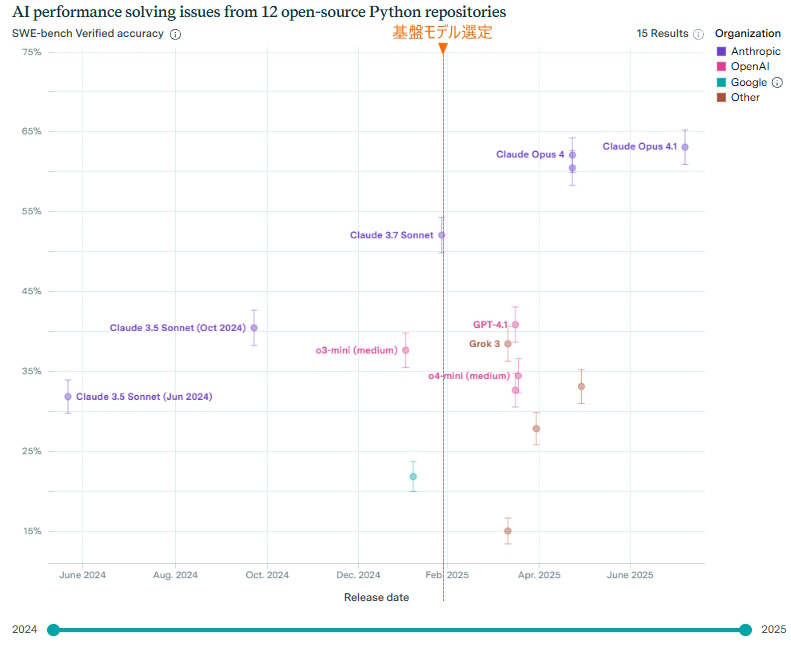

## 3. 生成AI、ツールの選定

## 3.1. 生成AI基盤モデルの選定方針

IaCコードの生成を行うために適した基盤モデルを選定する。

選定にあたり、IaCの能力を測定するために適したベンチマークの選定を行い、ベンチマークの結果を参考にする。

## 3.2. プログラミング性能を比較する主要なベンチマーク

生成AIの性能を評価するベンチマークは多数存在する。ベンチマークの選定にあたりプログラミングの性能を測定するベンチマークを中心に評価を行う。
特にIaCコードを生成する能力を評価するベンチマークを重視する。

(1) **DPIaC-Eval** はIaCコードを生成する能力に特化して評価している。**DPIaC-Eval**の結果を最重視する。
(2) **DPIaC-Eval** は2025年1月が最終更新日となっている。**SWE-bench**は最新の基盤モデルが発表されるたびに即時更新されるため最新モデルの評価は**SWE-bench**を参考にする。

### 主要なベンチマークの概要

- **HumanEval**  
OpenAIが公開したプログラミング問題セット。AIが生成したコードが、指定されたテストケースをどの程度正しくパスできるかをスコア（%）で評価します。主にPythonで実装力・ロジックの正確性を測る指標として業界標準になっています。
- **SWE-bench**  
GitHub上の実際のイシュー（バグや機能追加）の自動修正課題を用いて、AIモデルが本当に実用レベルのコードを自律生成・修正できるかを評価します。難度が高く、より現場に近い「実践力」を測る信頼性の高いベンチマークです。
- **MultiPL-E**  
複数のプログラミング言語（Python、Java、C++など）で同じ課題を解かせることで、各AIモデルの“多言語対応力”や汎用的なコーディング能力を測定します。幅広い開発現場での適応力を可視化します。
- **DPIaC-Eval（Deployability-centric Infrastructure-as-Code Eval）**  
153の実際のインフラシナリオで「展開可能性（deployability）」まで踏み込んで評価し、syntax・意図達成・セキュリティ考慮も判定。反復的なフィードバックでモデル精度がどこまで上がるかも計測。

## 3.3. DPIaC-Evalの概要

#### 参考連分

Deployability-Centric Infrastructure-as-Code Generation: An LLM-based Iterative Framework
展開可能性を重視したIaCの生成：LLMベースの反復型フレームワーク
https://arxiv.org/html/2506.05623v1
公開日：2025/1/5

概要

- IaC分野においての初回正答率は20～30%と著しく低く、一般的はプログラムの生成に対して著しく低い。
  - 特にセキュリティ面においてはほぼ考慮されない。
- 人の指示を加えた反復的なフィードバックを繰り返すことで90%程度まで精度が向上。最高スコアはClaude3.5を使用して25回反復した場合の98%。
- 基盤モデルの回答精度評価ではClaude 3.7、次いでClaude 3.5が高い回答精度を示した。

## 3.4. DPIaC-Eval発表後に公開された基盤モデルの性能

2025/8/7時点の**SWE-bench**によると**Claude Opus 4.1**が最も高いスコアを記録している。

基盤モデルの性能は急速に進化している。実装検証では **DPIaC-Eval** の結果に従いClaude 3.7を使用するが、IaCのコーディングを開始する際には各種ベンチマークを参照して使用する時点で最も性能の高い基盤モデルを選択することを推奨する。

## 3.5. 開発環境・ツールチェーン

### 3.5.1. IDE

生成AIを活用してコーディングを行うツールを選定する。

-**選定条件**
  - 生成AIのモデルとしてClaude 3.7を選択できること
  - エージェントモードを搭載していること。プロンプトの指示に従い、反復してコード生成が実行できること。

選定を行った2025年1月時点では2件の条件に合致するツールは次の2点であった。

#### (1) Cline

- 生成AIチャット機能、Visual Studio Codeの拡張機能として利用する。
- 入出力のトークン量に応じた従量課金制

#### (2) Cursor

- Visual Studio Codeを基本として生成AIの活用機能を追加したエディタ。
- リクエストの回数による課金

#### 比較

エージェントを利用した反復実行の場合、消費トークン量が膨大になることがあるため、従量課金はリクエスト数に対する課金に比べて不利になる。

検証では使用料金で優位になるCursorを使用する。

> ※注記 
> 2025年6月にCursorは消費トークン量による従量課金を導入した。 
> ツール毎に料金体系は頻繁に更新されるため、使用する際に随時確認いただきたい。

## 3.6. セキュリティとデータ取り扱い方針

生成AIを使用する場合に考慮する必要のあるセキュリティー上の条件を記載する。

使用する生成AI、開発ツールがセキュリティの条件に合致することを確認する。

### 3.6.1. 生成AIの学習によるデータ漏えい

生成AIによっては、ユーザーが入力したデータを学習データとして利用することがある。

システム開発で生成AIを使用を活用する場合には機密情報が生成AIに学習されないように考慮する必要がある。

機密情報の漏洩対策を考慮して、生成AIと開発ツールの選定とルールの作成を行う必要がある。

ユーザーがローカルのツールを使用して生成AIを活用する図
- 指示のミスにより生成AIへの指示にローカルのファイルが含まれることがある。
  ヒューマンエラーが原因になるため、完全に防ぐことは難しい。

図. 

### 3.6.2. データ漏えい対策状況

##### Claude

Claudeの全てのモデルは特殊なケースを除き、入力データを学習に使用しません。このことはAnthropicの公式プライバシーポリシーにに記載されています。

そのため、Claudeのモデルは、入力データを学習させないために追加の設定が必要なOpenAIのGPT-4.1などの生成AIと比較しても安全なモデルといえます。

- Claudeの生成AIが学習に使用するケース
  - 信頼性・安全性のレビューのためにフラグが立てられた会話
  - ユーザーが明示的に素材を報告し、学習に使うことに同意した場合
  - ユーザーが明示的に学習利用にオプトインした場合

##### Cursor

Cursorを使用する場合はPrivacy Modeの設定を"Privacy Mode"にします。

Privacy ModeをオンにするとCursorは次の情報を利用します。

- OpenAIなど生成AIモデルへの入力データの提供を許可
- 入力データと出力データをCursorのサービスに記録。記録したデータはCursorの機能向上のためｎ活用する。

##### まとめ

次の生成AIモデル。開発ツールを適切な設定で使用することでデータの漏洩を防ぐことができます。

- 生成AIのモデルはAnthropic社の提供するClaudeシリーズのモデルを使用する。
- CursorのPrivacy Modeの設定を"Privacy Mode"にする。
