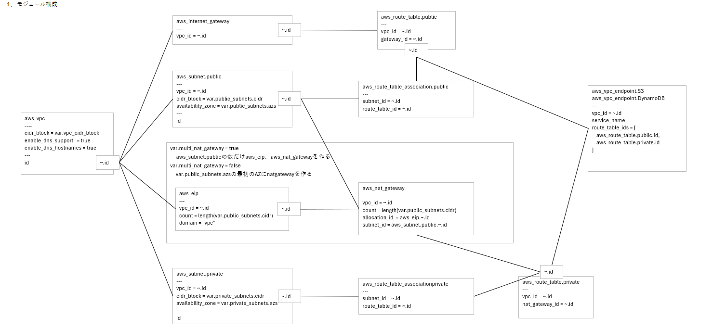

# 5. 実施結果 ケース① Terraformのコーディング技術がある場合

ケース①は作業者にTerraformのコーディングを行う十分な技術がある場合を想定する。  
作業者は生成するTerraformコードの詳細な指示を行う。生成されたTerraformコードのチェックを行う。

#### 想定手順

- (1) AWSのシステム構成図および基本設計書を作成する。
- (2) Terraformのコードに記載するAWSのリソース名を指定する詳細な設計書を作成する。
- (3) 生成AIにTerraformのコードを生成させる。
- (4) 作業者が生成されたTerraformコードのチェックを行う。  
      チェックは次の全ての作業を行う。
      - a. コード解析ツールによるチェック
      - b. 生成AIによるコードレビュー
      - c. 作業者によるコードレビュー
      - d. AWSへのデプロイ実行時のエラー対応
- (5) 手順(4)で実施するいずれかのチェックで修正箇所が見つかった場合は、手順(2)の設計書を修正して生成AIによるTerraformコードの生成を再実施する。
- (6) 手順(4)の全てのチェックに合格するまで手順(3)から手順(5)を繰り返す。

#### 作業者の作成する設計書

- (1) AWSシステム構成  
      使用するAWSサービスと主な用途をテキストで記載。
- (2) 基本設計書  
      システム構成図に記載したリソースの説明を記載する。システム内の役割やシステム構成図から読み取ることが困難な設定を記載する。
- (3) Terraformモジュール設計書
      Terraformで作成するリソースを記載する設計書。リソースに設定する設定値とリソース間の相関を記載する。
- (4) Terraformコーディングルール
      **Terraformモジュール設計書**からTerraformのコードを生成するためのルールを記載する。

## 5.2. 作業内容と作業時間

#### 作業者の作業内容と所要時間

|作業内容|作業時間|
|------|------|
|AWS設計   |8時間|
|Terraformモジュール設計   |18時間|
|Terraformコーディングルール| 4時間|

#### 生成AIの作業内容と所要時間

|作業内容|作業時間|
|------|------|
|コード生成|0.5時間|
|コードレビュー|0.5時間|

## 5.2. 方式の良い点

- Terraformモジュール設計書にTerraformコードで作成する全てのAWSリソースを記載した。  
  生成するTerraformコードの細部まで指定するため、意図したとおりのTerraformコードを生成することができる。
- リソース間の相関を図で記載するため、リソースの関係を理解しやすい。

## 5.3. 課題

- Terraformモジュール設計書の作成のためにコーディングと同等の作業時間が必要になる。
- 変更管理が行いづらい。
  検証の開始当初はリソース間の依存関係をテキストデータで表現するためER図や、UMLのクラス図、オブジェクト図などを使用することを検討した。
  Terraformのリソースとリソースの相関を的確に表現できる記法が見つからなかったため、独自機能の図を作成することとした。
  Terraformモジュール設計書はExcelの図で作成して、Cursorに生成を指示するときにはExcelから画像を作成して入力としている。
  Excelと画像を使用しているためテキストデータに比べて変更の差分が確認しづらくなる。
  テキストデータで作成する方法を見つけたい。

- 作成するAWSのリソースの設定を指示することに比べてTerraformモジュール設計書の記載内容が複雑になる。

#### 総括

ケース①ではTerraformモジュール設計書を作成することによって作成者の意図した通りのTerraformコードを作成することができた。
一方で、作成するAWSリソースの設定を的確に指定するためには作業時間が大きくなり、コーディングと比べてメリットがあまりないとも感じる。
ケース②では作成するAWSリソースが的確に作成するための最低限の情報を指示する方法を模索する。

