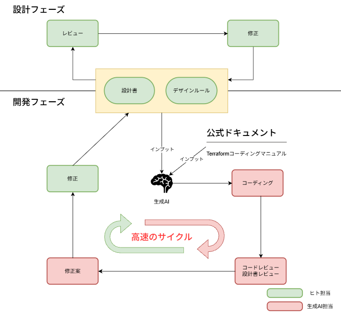

# 6. 効果検証

本章では5章で行った検証実績の結果からIaCに生成AIを活用したときの評価について考察する。

## 6.1. 総合評価

### 6.1.1. 生成AI活用の評価

### 6.1.2. 生成AIを活用する用途

(1) 設計書作成支援

- 生成AIに上流設計書から下位の設計書を作成させる
　　① システム構成図
　　② 基本設計書
　　③ 詳細設計書

- 生成AIと対話を重ねて設計書の制度を向上させる。

（効果）

- 作業時間の短縮
- 作業者の経験が不足している構成の場合は生成AIが知識を補っってくれる。
  → 作業者の理解が向上する。

(2) 設計書レビュー

① 生成AIに設計書に関するヒアリングシートを作成させて、作業者が回答する。
   暗黙知になっていた項目を明文化することにより、
   - 設計書の制度が向上する。
   - 作業者の理解が向上する。

② 生成AIにセキュリティや可用性などの観点を与えて評価させる。
   技術者

（3）コードレビュー

エラー発生時に、生成AIにエラーメッセージ、設計書、Terraformコードを入力して障害原因を推測させる。
障害原因の特定が迅速に行えることにより、対応までの時間が短縮される。

（4）障害原因調査

エラー発生時に、生成AIにエラーメッセージ、設計書、Terraformコードを入力して障害原因を推測させる。
障害原因の特定が迅速に行えることにより、対応までの時間が短縮される。

### 6.1.2. 効果が高いケース

設計変更からTerraformコーディング、環境構築までの時間が短縮されたため。開発のサイクルを高速で回せる

### 6.1.3. 適用条件と限界

生成AIは
- コーディング時間の大幅な短縮
- 幅広い知識により、技術者の知識不足の補填。
- コード、設計書の理解促進
など、多数の恩恵をもたらす。
一方で、最終的な成果物の精度は生成AIを使用する技術者の能力に依存する。

以下、典型的な課題

- 生成AIに観点を与えることのできる技術者が必要  
  依頼内容の制度に応じて生成されるコードの品質にばらつきが出る。  
  結局のところ、生成させる技術者が的確な観点を与えることができるかが重要になる。  

- 全ての障害は対応できない。  
  障害対応でコード修正、再試行を繰りかえしても解決しないことがある。
  生成AIの解決できない問題に対応できる技術者が必要。

## 6.2. ケース別の評価

全てのケースでアプリケーションの動作が行える環境を作成できた。

|#|観点|ケース①|ケース②|ケース③|
|---|---|---|
|1|作業時間|△|○|◎|
|2|完成度|◎|◎|○|
|3|再現性|◎|○|△|
|4|適合性|◎|◎|△|
|5|可読性|◎|○|△|

## 6.3. 技術者育成への影響

