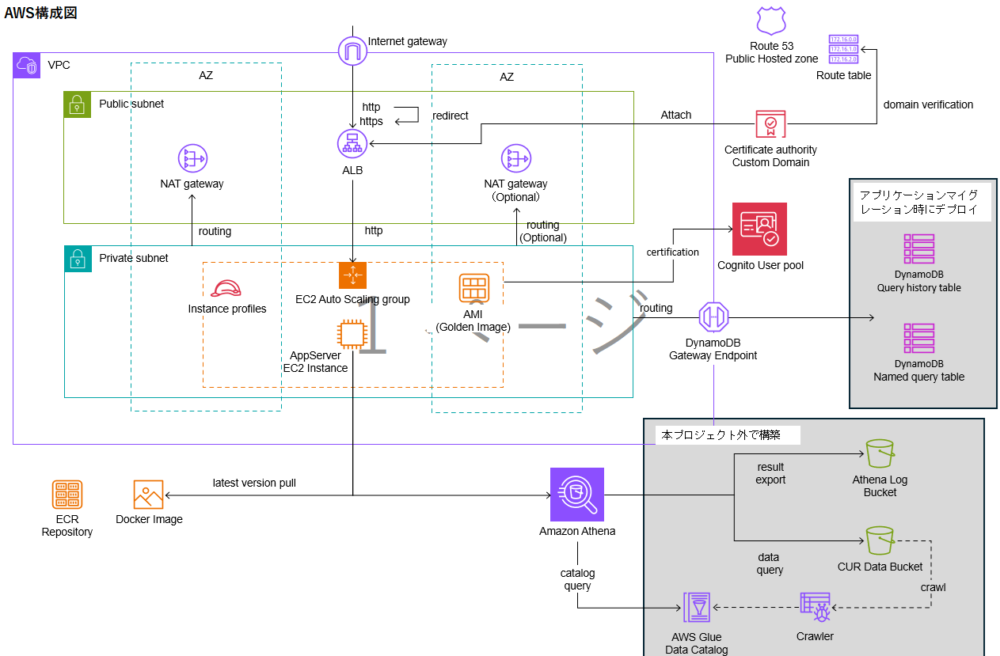

## 付録B. ケース②で作成したドキュメント

#### (1) システム構成図



<div class="page-break"></div>

#### (2) AWS基本設計

```markdown:AWS基本設計
# AWS基本設計

## 1. 概要
- 本システムは、EC2 Auto Scalingグループを中心としたWebアプリケーション基盤である。
- アプリケーションはEC2でDockerコンテナとして稼働し、CURデータを保存したS3バケットにAthenaクエリを実行し、結果を返す。
- クエリ実行結果は、Athena実行結果保存用のS3バケットに出力する。
- クエリ文はDynammoDBに保存し、再利用可能とする。

## 2. ネットワーク構成
- **VPC**:
  - システム全体のネットワークを分離する。
  - IPv6は無効とする。
- **サブネット**:
  - パブリックサブネット: ALB、NAT Gatewayを配置する。
  - プライベートサブネット: EC2インスタンス（アプリケーションサーバー）を配置する。
- **AZ（アベイラビリティゾーン）**:
  - 冗長化のため複数AZにまたがって構成する。
- **Internet Gateway**:
  - インターネットアクセスを提供する。
- **NAT Gateway**:
  - プライベートサブネットからの外部アクセスを可能にする。
- **Route Table**:
  - 各サブネットのルーティングを制御する。
- **DynamoDB VPCエンドポイント**:
  - すべてのサブネットから、インターネットを経由せずにDynamoDBへセキュアにアクセスできるようにする。

## 3. サーバー・コンピューティング
- **EC2 Auto Scaling Group**:
  - パフォーマンス監視による自動スケールは行わない。
  - 指定したEC2インスタンス数が常に起動しているようにシステムを維持する。
  - EC2インスタンスは、各AZに均等に分散する。
  - ユーザーデータでOS環境変数を設定する。
- **AMI (Golden Image)**:
  - 運用によってメンテナンスされるAMI（ゴールデンイメージ）を利用する。
- **ECR Registry & Docker Image**:
  - EC2インスタンス起動時、ユーザーデータでECRからlatestバージョンをpullして起動する。

## 4. ロードバランサー・ドメイン
- **ALB (Application Load Balancer)**:
  - アプリケーションサーバーへのHTTP/HTTPSトラフィックの分散を行う。
  - スティッキーセッション（セッション維持）は使用しない。
- **Route 53**:
  - 同一AWSアカウントのホストゾーンでALBの名前解決をおこなう。
- **Certificate Authority**:
  - 同一AWSアカウントの独自ドメインでSSL証明書のDNS検証を行う。
```

```markdown:AWS基本設計

## 5. データベース
- **DynamoDB**:
  - DynamoDB Gateway Endpoint経由でプライベートサブネットからアクセスする。
  - Query history table: アプリケーションがAthenaに実行したクエリ文の履歴テーブルとする。
  - Named query table: Athenaに実行したクエリ文を名前をつけて保存するテーブルとする。
- **DynamoDB Gateway Endpoint**:
  - VPC内からDynamoDBへのセキュアな通信を実現する。

## 6. 分析・ログ
- **Amazon Athena**:
  - S3上のデータに対してクエリを実行する。
- **Athena Log Bucket**:
  - Athenaのクエリ結果をS3バケットに保存する。
- **CUR Data Bucket**:
  - コスト・利用状況レポート（CUR）をS3バケットに保存する。
- **AWS Glue Data Catalog & Crawler**:
  - データカタログを管理し、S3データのスキーマ自動検出を行う。

## 7. 認証・認可
- **Amazon Cognito User Pool**:
  - アプリケーションサーバーへのユーザー認証を提供する。
  - ユーザー登録、ログイン、パスワードリセット機能を提供する。
  - JWTトークンベースの認証を実装する。
  - ユーザー名としてメールアドレスを使用する。
  - メールアドレスの自動検証を有効化する。
- **Cognito User Pool Client**:
  - SRPプロトコル（ALLOW_USER_SRP_AUTH）による安全な認証フローを提供する。
  - パスワード認証（ALLOW_USER_PASSWORD_AUTH）もサポートする。
  - リフレッシュトークン（ALLOW_REFRESH_TOKEN_AUTH）による長期セッション管理を提供する。
  - PKCE（Proof Key for Code Exchange）をサポートし、セキュリティを強化する。
- **Cognito User Pool Domain**:
  - Cognitoホスト型UIへのアクセス用ドメインを提供する。
  - OAuth 2.0フローをサポートする。
- **管理者ユーザー管理**:
  - システム初期化時に管理者ユーザーを自動作成する機能を提供する。
  - 管理者ユーザーは専用の「Admins」グループに所属する。
  - 管理者ユーザーの初期パスワードは自動生成し、セキュアに管理する。
- **認証フロー**:
  - ユーザーはCognito User Pool経由でアプリケーションにログインする。
  - 認証成功時にJWTトークン（ID Token、Access Token）を発行する。
  - アプリケーションサーバーはJWTトークンを検証してユーザー認証を行う。
- **認可制御**:
  - 認証されたユーザーのみがAthenaクエリ実行機能にアクセス可能とする。
  - DynamoDBのクエリ履歴・名前付きクエリはユーザー単位で分離せず、共用する。
  - 管理者グループのユーザーには追加の権限を付与可能とする。
- **セッション管理**:
  - JWTトークンの有効期限を適切に設定する（ID Token: 1時間、Access Token: 1時間、Refresh Token: 30日）。
  - ログアウト時にはクライアント側でトークンを破棄する。
- **ユーザー管理**:
  - ユーザー管理（ユーザー登録、削除、パスワードリセット）はAWSマネジメントコンソールまたは管理者機能から行う。
  - 管理者ユーザーは自動作成され、初期パスワードは安全に生成・管理される。

## 8. セキュリティ
- **パブリック/プライベートサブネット分離**:
  - 外部公開リソースと内部リソースを分離する。
- **ALB経由の通信制御**:
  - 直接EC2にアクセスできないようにする。
- **DynamoDB Gateway Endpoint**:
  - インターネット経由せずにDynamoDBへアクセスする。
- **証明書管理**:
  - Route 53と連携してドメイン認証を行う。
- **EC2へのSSH接続制御**:
  - EC2インスタンスはSSMマネージドノードとし、SSMフリーとマネージャで管理接続する。
- **認証セキュリティ**:
  - Cognito User Poolでパスワードポリシーを強制する（最小8文字、大文字・小文字・数字・特殊文字を含む）。
  - MFA（多要素認証）をオプションで有効化可能とする。
  - JWTトークンの署名検証を必須とする。
  - ユーザー存在エラーの防止機能を有効化する。
  - 管理者ユーザーの初期パスワードは強力なランダムパスワードを自動生成する。

## 9. データフロー
- ユーザーはRoute 53経由でALBにアクセスする。
- ALBがリクエストをEC2 Auto Scaling Groupのアプリケーションサーバーに転送する。
- アプリケーションサーバーは認証が必要な機能に対してCognito User PoolでJWTトークンを検証する。
- 認証されたユーザーのリクエストに対して、アプリケーションサーバーは必要に応じてDynamoDBへデータアクセスを行う（Gateway Endpoint経由）。
- アプリケーションのログやデータはS3バケットに保存し、Athenaで分析する。
- DockerイメージはECRからpullする。

## 10. 本設計外で構築するリソース
- **Route 53**
  - 独自ドメインの管理。
  - 証明書の検証、ALBのレコード登録は可能とする。
- **Athena Log Bucket**:
  - Athenaのクエリ結果を保存するS3バケット。
- **CUR Data Bucket**:
  - コスト・利用状況レポート（CUR）を保存するS3バケット。
- **AWS Glue Data Catalog**:
  - S3データのカタログ情報。
- **Crawler**:
  - S3バケット内のデータを自動でクロールし、Glue Data Catalogにスキーマ情報を登録する。
- **DynamoDBテーブル**:
  - アプリケーションマイグレーション時に、アプリケーションがデプロイする。

## 11. その他
- **冗長化・可用性**:
  - 複数AZ構成、Auto Scalingを実施する。
- **拡張性**:
  - Auto Scaling、マネージドサービスを活用する。
- **運用**:
  - AMIによる標準化、ECRによるイメージ管理を行う。

---

以上、本システムのAWS基本設計とする。 

```

<div class="page-break"></div>

#### (3) AWS詳細設計

```markdown:AWS詳細設計
# AWS詳細設計

## 1. 概要
- AWSシステムを、Terraformでデプロイするための詳細設計を行う。
- 以下はTerraformのデプロイ対象外とする。
  - EC2インスタンスのAMI（AMIはゴールデンマスタ方式とし、人的な運用で維持管理する）
  - アプリケーションのビルド（GitHub ActionsでDockerコンテナをビルドし、ECRリポジトリにアップロードする）
  - Athenaの結果を出力するS3バケット
  - CURデータを保存するS3バケット
  - CURデータをクロールするGlue Crawlerと、作成されるGlue Data Catalog
  - DynamoDBテーブル（アプリケーション実行時にGitHub Actionsで動的に作成され、Systems Manager Parameter Storeでテーブル名を管理する）

## 2. ネットワーク構成
- **VPC**:
  - CIDRブロックは/24限定とする。
- **AZ（アベイラビリティゾーン）**:
  - 最低2つのAZで構成し、デプロイパラメータ指定で3つ以上に拡張可能とする。
- **サブネット**:
  - パブリックサブネット:
     - NAT Gateway
        - 1つ目のAZには必ず配置する。
        - 2つ目以降のAZにNAT GatewayをデプロイするマルチNAT構成はオプショナルとし、デプロイパラメータで設定可能とする。
  - プライベートサブネット:
     - マルチNAT構成の場合、同一AZのNAT Gatewayをデフォルトルートとする。
- **DynamoDB　VPCエンドポイント**:
  - Gatewayタイプでデプロイする。
  - すべてのサブネットにルーティングを追加する。

## 3. サーバー・コンピューティング
- **EC2 Auto Scaling Group**:
  - 最低数をデプロイパラメータで指定可能とする。
  - 最低数と最大数は同じとする。
  - AMI IDはデプロイパラメータで指定可能とする。
- **ECR Repository**:
  - リポジトリ名をデプロイパラメータで指定可能とする。
- **EC2**:
  - ユーザーデータ:   
     AMIに含まれていない以下の処理だけを実行する。
     1. タイムゾーンを日本に設定する。
     1. OS環境変数を設定する。  
        - Systems Manager Parameter StoreからDynamoDBテーブル名を動的に取得する。
        - 取得できない場合はデフォルト値を使用する。

```

```markdown:AWS詳細設計
        
        | OS環境変数名 | 用途 | 設定方法 |
        |----|----|----|
        | AWS_REGION | AWSリージョン | Terraformから動的設定 |
        | AWS_DEFAULT_REGION | AWSデフォルトリージョン | Terraformから動的設定 |
        | ATHENA_DATABASE | Athenaデータベース名 | Terraformから動的設定 |
        | ATHENA_WORKGROUP | Athenaワークグループ名 | Terraformから動的設定 |
        | ATHENA_OUTPUT_LOCATION | Athenaクエリ結果出力S3バケット（URL） | Terraformから動的設定 |
        | DYNAMODB_QUERIES_TABLE | クエリ保存用DynamoDBテーブル名 | Parameter Storeから動的取得 |
        | DYNAMODB_EXECUTIONS_TABLE | 実行履歴用DynamoDBテーブル名 | Parameter Storeから動的取得 |
        | DYNAMODB_TAGS_TABLE | タグ管理用DynamoDBテーブル名 | Parameter Storeから動的取得 |
        | COGNITO_USER_POOL_ID | Cognito User Pool ID | Terraformから動的設定 |
        | COGNITO_CLIENT_ID | Cognito User Pool Client ID | Terraformから動的設定 |
        | COGNITO_REGION | Cognito User Poolのリージョン | Terraformから動的設定 |
     1. ECRリポジトリからlatestバージョンのDockerイメージをpullする。
     1. .env.productionファイルを作成し、環境変数を設定する。
     1. Dockerイメージを起動する。
        - 作成した.env.productionファイルを環境変数ファイルとしてコンテナに渡す。
        - ポートフォワーディングは80:80。
        - コンテナ名は「app-container」とし、再起動ポリシーを「unless-stopped」に設定する。
  - インスタンスプロファイル:
     - インラインでカスタムポリシーを作成する。  
       | 対象リソース | アクション | 許可 | 備考 |
       |----|----|----|----|
       | DynamoDBテーブル | フルアクセス | 許可 | 本プロジェクトで作成したテーブルのみ |
       | Systems Manager Parameter Store | 読み取り専用 | 許可 | DynamoDBテーブル名取得用 |
       | Athena | フルアクセス | 許可 | 本AWSアカウントのAthenaのみ |
       | S3バケット | フルアクセス | 許可 | 本AWSアカウントのS3バケットのみ |
       | Cognito | 読み取り専用 | 許可 | JWKSエンドポイントアクセス用 |
       | ECR | 読み取り専用 | 許可 | Dockerイメージpull用 |
     - その他、要件を満たすために必要なマネージドポリシーを適宜アタッチする。

## 4. ロードバランサー・ドメイン
- **ALB (Application Load Balancer)**:
  - セキュリティグループ
    - インバウンドルール
      - デプロイパラメータでソースIPアドレスを複数指定可能とする。
      - ソースIPアドレスに対してHTTP、HTTPSを許可する。
  - ヘルスチェック
      - ヘルスチェックパスはデプロイパラメータで指定可能とする。
  - ドメイン名
     - デプロイパラメータで指定可能とする。
  - FQDN
     - デプロイパラメータで指定可能とする。
  - 証明書
      - Route53でドメイン検証を行う。  

## 5. データベース
- **DynamoDB**:
  - **テーブル作成方針**:
    - DynamoDBテーブルはTerraformではなく、GitHub Actionsでアプリケーション実行時に動的に作成される。
    - 作成されたテーブル名はSystems Manager Parameter Storeに保存される。
    - EC2インスタンスのユーザーデータでParameter Storeからテーブル名を取得し、環境変数として設定する。
  - **Systems Manager Parameter Store設定**:
    - パラメータ名: `/{project}/{env}/dynamodb/table-names`
    - 形式: StringList（カンマ区切りのテーブル名リスト）
    - 初期値: "placeholder"（GitHub Actionsで実際の値に更新）
    - ライフサイクル管理: 値の変更を無視（ignore_changes = [value]）
  - **テーブル命名規則**:
    - クエリ保存用: `{project}-{env}-queries`
    - 実行履歴用: `{project}-{env}-executions`  
    - タグ管理用: `{project}-{env}-tags`
  - **フォールバック設定**:
    - Parameter Storeからテーブル名が取得できない場合、上記命名規則に従ったデフォルト値を使用する。

## 6. 認証・認可
- **Amazon Cognito User Pool**:
  - User Pool名をデプロイパラメータで指定可能とする。
  - ユーザー名設定:
    - ユーザー名属性としてメールアドレスを使用する（username_attributes = ["email"]）。
  - 自動検証設定:
    - メールアドレスの自動検証を有効化する（auto_verified_attributes = ["email"]）。
  - パスワードポリシー:
    - 最小文字数: 8文字以上
    - 大文字、小文字、数字、特殊文字を含む
    - 一時パスワードの有効期限: 7日
  - アカウント復旧設定:
    - パスワードリセット機能を有効化する。
    - 検証方法はEmailとする（verified_email優先度1）。
  - メール設定:
    - Cognito標準のメール送信機能を使用する（COGNITO_DEFAULT）。
  - セキュリティ設定:
    - ユーザー存在エラーの防止機能を有効化する（prevent_user_existence_errors = "ENABLED"）。
  - 削除保護:
    - 削除保護を無効化する（deletion_protection = "INACTIVE"）。
  - MFA（多要素認証）:
    - オプショナル設定とし、デプロイパラメータで有効/無効を指定可能とする。
    - SMS、TOTPアプリケーションの両方をサポートする。
  - ユーザー属性:
    - 必須属性: email
    - オプション属性: name, family_name, given_name
    - email属性の検証を必須とする。
- **Cognito User Pool Client**:
  - Client名をデプロイパラメータで指定可能とする。
  - 認証フロー:
    - ALLOW_USER_PASSWORD_AUTH（ユーザー名・パスワード認証）を有効化する。
    - ALLOW_USER_SRP_AUTH（SRPプロトコル）を有効化する。
    - ALLOW_REFRESH_TOKEN_AUTH（リフレッシュトークン）を有効化する。
  - トークン有効期限:
    - ID Token: 1時間（60分）
    - Access Token: 1時間（60分）
    - Refresh Token: 30日
  - トークン有効期限単位:
    - Access Token、ID Token: 分単位（minutes）
    - Refresh Token: 日単位（days）
  - セキュリティ設定:
    - ユーザー存在エラーの防止機能を有効化する（prevent_user_existence_errors = "ENABLED"）。
    - クライアントシークレットは生成しない（generate_secret = false）。
  - OAuth設定:
    - サポートするアイデンティティプロバイダー: COGNITO
    - 認可コードフローを有効化する。
    - スコープ: openid, email, profile
  - コールバックURL:
    - デプロイパラメータで指定可能とする。
  - ログアウトURL:
    - デプロイパラメータで指定可能とする。
    - デフォルト: ["http://localhost:3000/"]
- **Cognito User Pool Domain**:
  - ドメイン名をデプロイパラメータで指定可能とする。
  - Cognitoホスト型UIへのアクセス用ドメインを提供する。
  - OAuth 2.0フローをサポートする。
- **管理者ユーザー自動作成機能**:
  - 管理者ユーザー作成フラグをデプロイパラメータで指定可能とする（create_admin_user）。
  - 管理者メールアドレスをデプロイパラメータで指定可能とする。
  - メールアドレス形式のバリデーションを実装する。
  - 管理者ユーザーの初期パスワード生成:
    - 16文字のランダムパスワードを自動生成する。
    - パスワードポリシーに準拠（大文字・小文字・数字・特殊文字を各1文字以上含む）。
    - 初回ログイン時のパスワード変更を強制しない（message_action = "SUPPRESS"）。
  - 管理者ユーザー属性:
    - username: 管理者メールアドレス
    - email: 管理者メールアドレス
    - email_verified: true（検証済み）
- **ユーザーグループ管理**:
  - 管理者グループ「Admins」を自動作成する。
  - グループ設定:
    - グループ名: "Admins"
    - 説明: "管理者グループ"
    - 優先度: 1
  - 管理者ユーザーを自動的にAdminsグループに追加する。
- **セキュリティ設定**:
  - User Pool Domain:
    - Cognitoドメインまたはカスタムドメインをデプロイパラメータで選択可能とする。
  - 高度なセキュリティ機能:
    - 異常なサインイン試行の検出を有効化する。
    - アダプティブ認証を有効化する。
  - デバイス追跡:
    - オプショナル設定とし、デプロイパラメータで有効/無効を指定可能とする。
- **出力値**:
  - User Pool ID: アプリケーションの環境変数として使用
  - User Pool ARN: IAMポリシーでの参照用
  - User Pool Client ID: アプリケーションの環境変数として使用
  - User Pool Domain: OAuth フロー用
  - User Pool Endpoint: JWKSエンドポイントアクセス用
  - 管理者ユーザー情報: メールアドレス、ユーザー名、初期パスワード（機密情報として管理）

## 7. タグ戦略
- タグを付与できるリソース全てにタグを付ける。
- 以下のタグをデプロイパラメータで指定可能とする。
   - **project**
   - **env**
   - **owner**
   - **department**
- Nameタグには、以下のタグ値を組み合わせたプレフィックスを付与する。
   -  `project-env-`

---

以上、本システムのAWS詳細設計とする。

```

<div class="page-break"></div>

## (4) Terraform設計書

```markdown:Terraform設計書
# Terraform設計書

## 1. 概要
- TerraformのIaCコード設計方針を記載する。

## 2. Terraform要件
- Terraformバージョン: 1.9.8以上
- AWSプロバイダー: hashicorp/aws（5.74.0以上）
- バックエンド: S3

## 構成ファイル
- プロジェクトツリー
    ```
    project/infrastructure/core_infra2
    ├── iac_code
    │   ├── env
    │   │   ├── sample.tfvars
    │   │   └── sample_backend.tfvars
    │   ├── variables.tf
    │   ├── main.tf
    │   ├── provider.tf
    │   └── modules/
    ├── override.tf.local
    ├── tf_init.sh
    ├── tf_plan.sh
    ├── tf_apply.sh
    └── tf_destroy.sh
    ```

- ディレクトリ
  - env  
     - Github ActionsのTerraformデプロイ時に参照されるtfversファイルを格納する。
     - sampleファイルを作成する。
  - iac_code  
     - terraformコードを格納する。
     - 最低限、`main.tf`、`variables.tf`、`provider.tf`に分割する。
     - 可読性向上のため、`main.tf`の内容を`modules`ディレクトリ配下に分割して良い。

  - ローカルデプロイ用ファイル 
     - override.tf.local
       ```
       terraform {
         # tfstateファイルをローカルに保存する
         backend "local" {
           path = "terraform.tfstate"
         }
       }
       ```
```   

```markdown:Terraform設計書
     - デプロイシェル（共通処理）
       - 第一引数にtfvarsファイルを要求する（必須）
       - 第二引数にbackend_tfvarsファイルを要求する（オプション）
       - 第一引数、第二引数はcore_infraディレクトリからの相対パスで指定する
       - バックエンド設定の判定
         - 第二引数が指定された場合：S3バックエンドを使用
         - 第二引数が未指定の場合：ローカルバックエンドを使用（`override.tf.local`を`iac_code/override.tf`にコピー）
       - AWSプロファイルを「NCP-TF-HOMEWORK03」に変更
       - 処理の最後に`iac_code/override.tf`を削除する
     - デプロイシェル（個別処理）
       - tf_init.sh
         - S3バックエンド使用時：`terraform init -upgrade -backend-config=第二引数 -var-file=第一引数`
         - ローカルバックエンド使用時：`terraform init -upgrade -var-file=第一引数`
       - tf_plan.sh
         - `terraform plan -var-file=第一引数`コマンドを実行する
       - tf_apply.sh
         - 第二引数が指定された場合：`terraform apply -var-file=第一引数 -auto-approve`コマンドを実行する
         - 第二引数が未指定の場合：`terraform apply -var-file=第一引数`コマンドを実行する
       - tf_destroy.sh
         - 第二引数が指定された場合：`terraform destroy -var-file=第一引数 -auto-approve`コマンドを実行する
         - 第二引数が未指定の場合：`terraform destroy -var-file=第一引数`コマンドを実行する

## 3. 使用例

### ローカルバックエンドでの実行
    ```bash
    # 初期化
    ./tf_init.sh sample.tfvars

    # プラン確認
    ./tf_plan.sh sample.tfvars

    # 適用
    ./tf_apply.sh sample.tfvars

    # 削除
    ./tf_destroy.sh sample.tfvars
    ```

### S3バックエンドでの実行
    ```bash
    # 初期化
    ./tf_init.sh sample.tfvars sample_backend.tfvars

    # プラン確認
    ./tf_plan.sh sample.tfvars sample_backend.tfvars

    # 適用
    ./tf_apply.sh sample.tfvars sample_backend.tfvars

    # 削除
    ./tf_destroy.sh sample.tfvars sample_backend.tfvars
    ```

---

以上、本システムのTerraform設計とする。

```