# 6. 実施結果 ケース② AWS設計書から生成

ケース②はAWS設計書からTerraformコードを生成した。


## 6.1. 作業者のスキルレベル


## 6.2. 生成AIの入力

- (1) システム構成図  
      AWSのシステム構成図。
- (2) 基本設計書  
      システム構成図に記載したリソースの説明を記載する。システム内の役割やシステム構成図から読み取ることが困難な設定を記載する。
- (3) 詳細設計書  
      AWSリソースの詳細な設定を記載する。基本設計では記載していないパラメータなどを明示する。
- (4) Terraformコーディング規約
      Terraformコードのディレクトリ構造などコーディングのルールを指定する。

## 6.3. 完了条件

設計書から生成したコードがエラーなくデプロイ成功するまで設計書を修正して再生成する。

## 付録A. ケース①で作成したドキュメント

#### (1) AWSシステム構成図

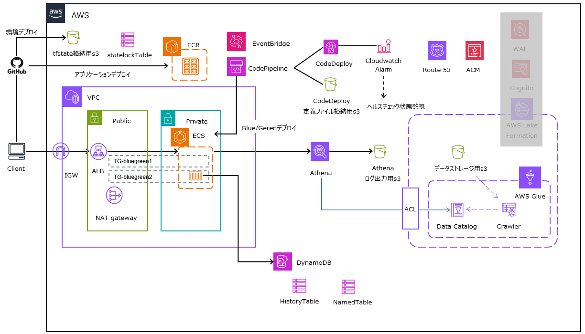

#### (2) rootモジュール設計書の記載ルール

```markdown:rootモジュール設計書
# 基本ルール

TerraFormのrootモジュール設計を、プロンプトに画像で提供します。
生成AIは、その画像をもとに、サブモジュールを結合するTerraformのrootモジュールコードを生成します。

## 1. 宣言

このルールを使用する処理を実行する場合は"◆◆TerraFormルートモジュール設計に従い、rootモジュールコードを作成します◆◆"と言ってください。

## 2. rootモジュール設計書の解釈
### 2.1. Terraformコード出力仕様
1. 基本情報
    - 「パス」に「rootモジュールファイル」、「変数定義ファイル」、「パラメータ定義ファイル」を作成
    - 「rootモジュールファイル」に、「モジュールパス」のサブモジュールを結合するterraformのコードを作成
    - 「変数定義ファイル」に、rootモジュールの変数を定義する。
    - 「パラメータ定義ファイル」に、rootモジュールのパラメータを記載する。
    - 「パラメータ定義ファイル」の初回作成時は、サンプルパラメータを入力しておく

2. Terraform環境定義
    - 「Terraformバージョン」は、生成するコードのTerraformバージョン
    - 「プロバイダーソース」「プロバイダーソースバージョン」は、生成するコードのプロバイダー情報
```

```markdown:rootモジュール設計書
### 2.1. モジュール間インターフェース構成
  -  オブジェクト
    - モジュールを四角いオブジェクトで表現する
    - 「モジュール：root」に付随する「variable」オブジェクトは、「変数定義ファイル」で定義する変数を意味する。
    - 「モジュール：root」に付随する「variable」のパラメータは、「パラメータ定義ファイル」に記載する。
    - 「サブモジュール：」から始まる四角いオブジェクトが、結合対象のサブモジュールである。
    - 「サブモジュール：」に付随する「variable」は、サブモジュールが要求するパラメータを意味する。
    - 「サブモジュール：」に付随する「output」は、サブモジュールがrootモジュールに返すパラメータを意味する。
  - モジュールの関係性
    - 「variable」方向に向かう線
      - rootモジュールが、サブモジュールを呼び出す際に与えるパラメータを意味する。

### 2.3. Terraformコードのコメント仕様
    - .tfファイルの最初に処理概要を記載
    - リソースの処理概要をリソース前に記載

## 3. コード生成時の挙動
    - 対象となるサブモジュールを、コード作成前に必ずスキャンする
    - 解釈が一意に定まらない場合、自己判断せず、ユーザーに対話形式で質問、提案すること
```

#### (3) TerraFormモジュール設計の記載ルール

```markdown:TerraForm モジュール設計
# 基本ルール

TerraFormモジュール設計を、プロンプトに画像で提供します。
生成AIは、その画像をもとにTerraformコードを生成します。

## 1. 宣言

このルールを使用する処理を実行する場合は"◆◆TerraFormモジュール設計に従い、Terraformコードを作成します◆◆"と言ってください。

## 2. モジュール設計書の解釈
### 2.1. モジュール構成
    - リソースブロックを四角いオブジェクトで表現する
    - 四角いオブジェクト内の「---」で区切られたブロックは、以下の意味を持つ
        - 第1ブロック：リソースタイプ.リソース名
            - 「resource "リソース名" "リソース名" {}」　でコードブロックを生成する
            - data.で始まる場合は、「data "リソースタイプ" "リソース名"」で既存のリソースを参照する
            - リソース名の指定が省略されている場合は、任意の値を使う
            - 複数行書かれている場合は、同じ内容で行数分のリソースブロックを作成する
```

```markdown:TerraForm モジュール設計
        - 第2ブロック：リソースブロックの属性
            - 主な属性を記載
            - 記載されていない必須の属性は、デフォルト値を設定する
            - 記載されていないOptionalの属性は、必要な場合、デフォルト値を設定する
            - 値が指定されている属性は、その値を設定する
            - 値が指定されていない属性は、デフォルト値を使用する
            - var.で始まる値は、変数定義ファイルから取得する
            - ~.で始まる値は、別リソースブロックのAttributeを参照していることを意味する
            - ~.は「別リソースブロック.リソース名」を省略したものである
            - ~.に続く文字列は、参照元リソースブロックのAttributeを意味する
        - 第3ブロック：出力
            - リソースブロックが出力定義ファイルに出力するAttributeを記載する
            - リソースブロックが省略されている場合は、Attributeを出力しない 
    - リソースブロックに付属する四角いブロック
        - 別のリソースブロックが参照するAttributeを表現している
        - ~.は「リソースブロック.リソース名」を省略したものである
    - リソースブロックを繋ぐ線
        - 線は関係を示すものであるが、依存関係を示すものではない。
        - 明確な依存関係の設定が望ましい場合は、[depends_on]を指定してよい

### 2.2. Terraformコード出力仕様
1. 基本情報
    - 「パス」にモジュールディレクトリを作成
    - モジュールディレクトリに、メインコードファイル、変数定義ファイル、出力定義ファイルを作成

1. 変数定義ファイル
    - モジュールが引き受けるパラメータを記載する。

1. 出力定義ファイル
    - 出力名 = 出力の値
    - 出力の値の末尾に[]で型指された場合は、その型に従う。

1. モジュール構成
    - モジュールを構成するリソースを記載する。
    - 内容は「2. モジュール設計書の解釈」に従う。

1. その他ファイル
    - モジュールに付随するその他のファイルを記載する。
    - 指定がない限り、ファイルはモジュールディレクトリの直下に配置する。

### 2.3. Terraformコードのコメント仕様
    - .tfファイルの最初に処理概要を記載
    - リソースの処理概要をリソース前に記載
```

<div class="page-break"></div>


#### (4) TerraForm モジュール設計図

##### ① モジュール：root

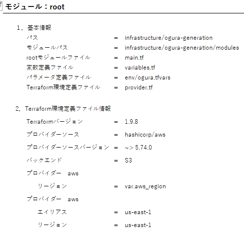


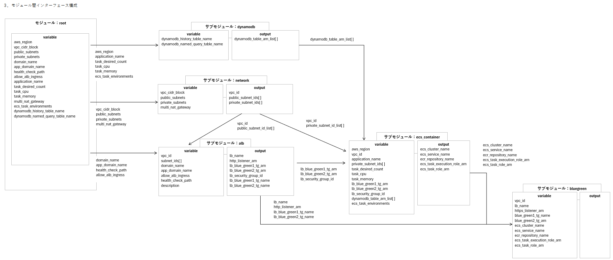

<div class="page-break"></div>

##### ② モジュール：Network

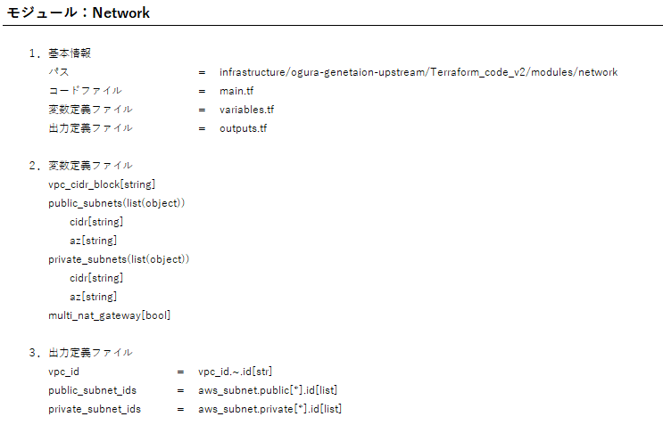

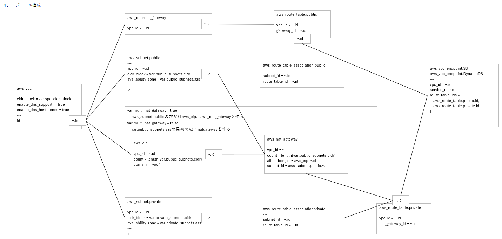

<div class="page-break"></div>

##### ③ モジュール：ALB

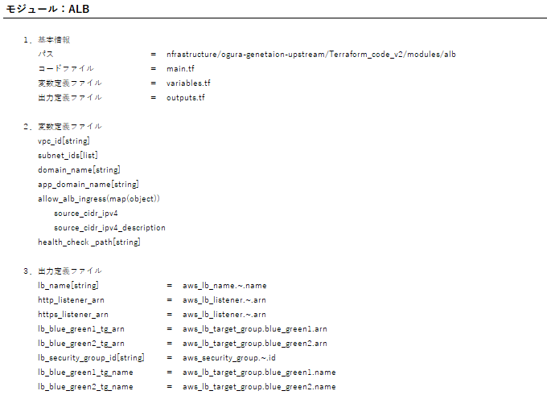

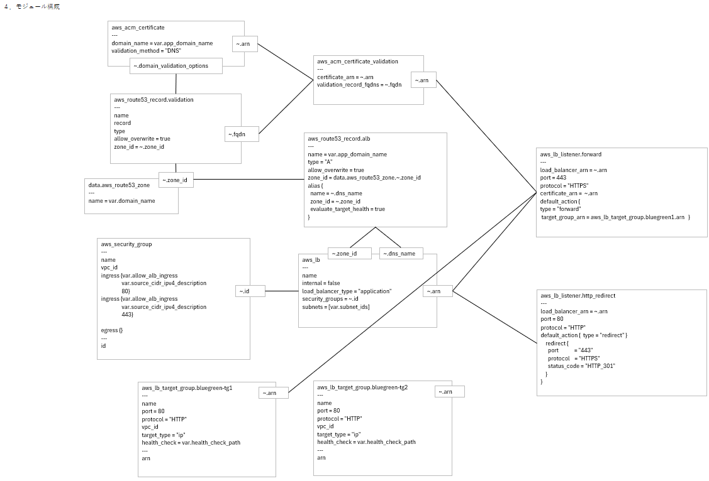

<div class="page-break"></div>

##### ④ モジュール：ECS_Container

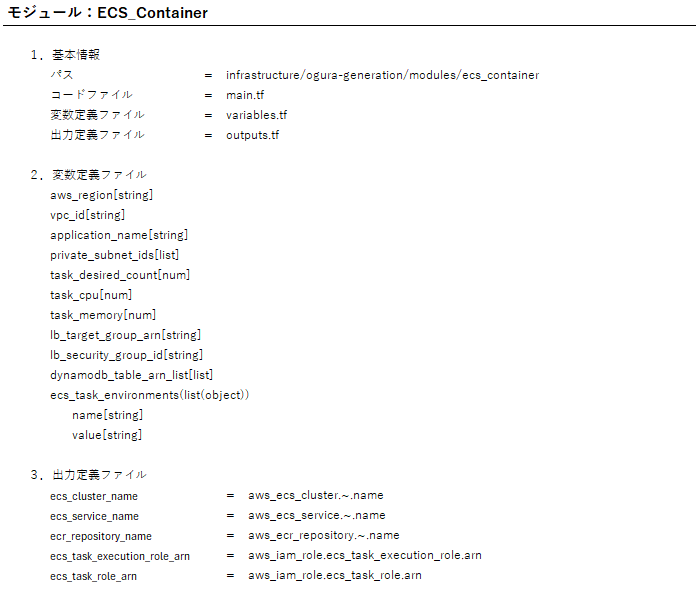

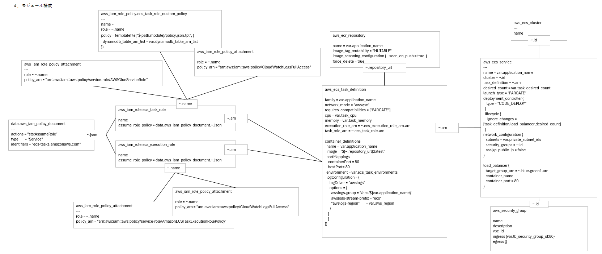

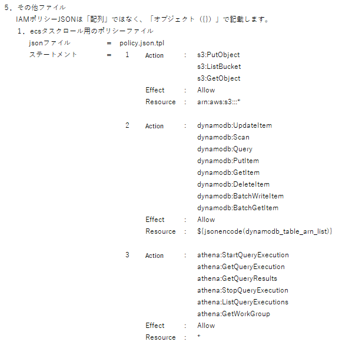

<div class="page-break"></div>

##### ⑤ モジュール：DynamoDB

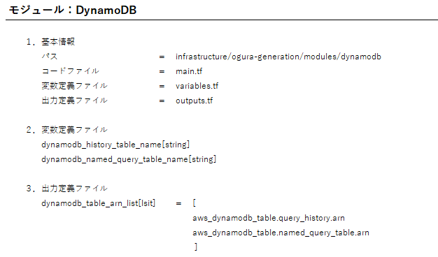

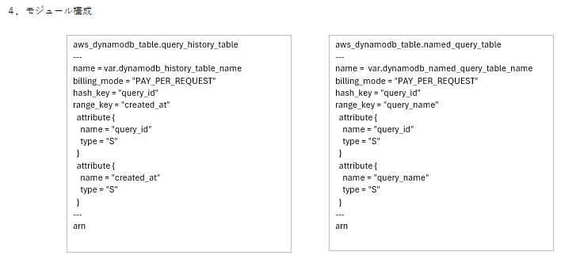

<div class="page-break"></div>

### ⑥ モジュール：BlueGreen

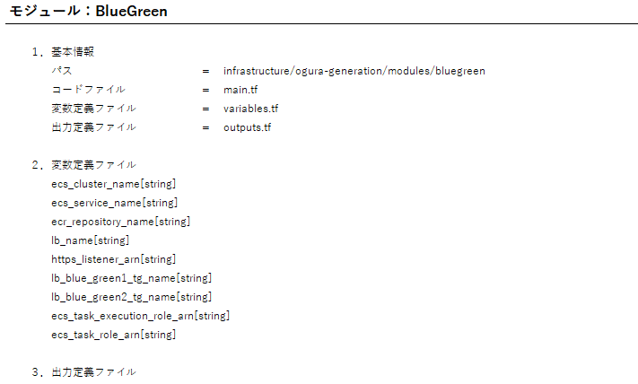

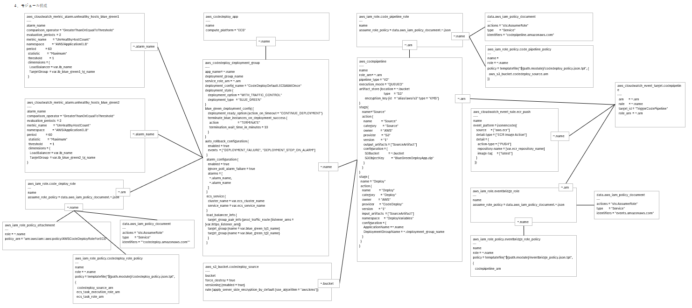

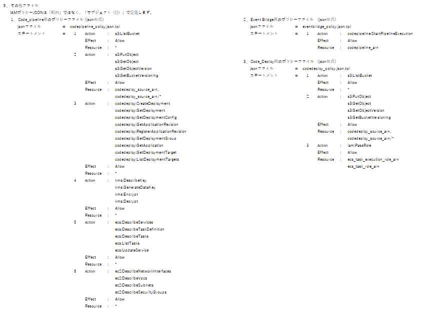


## 6.3. 出力

- Terraformコード
  - AWSコマンドデプロイ成功
  - AWS設計指示は的確に反映

- 同一入力で再生成
  - AWS設計設計は的確に反映
      - アプリケーションは動きました
  - 初回とは違うコードができた
  - AWS設計設計に書いていない設定は違う設定になった

## 6.4. 問題点

##### (1) 生成するAWSリソースの設定値が安定しない。

AWSリソースの設定を設計書で明示的に指定していない場合は生成AIの解釈により設定内容を決定する。

##### (2) 生成するTerraformコードが安定しない。

Terraform設計書で明示的に指定していない箇所のコーディングについては生成AIが独自に解釈して行う。


