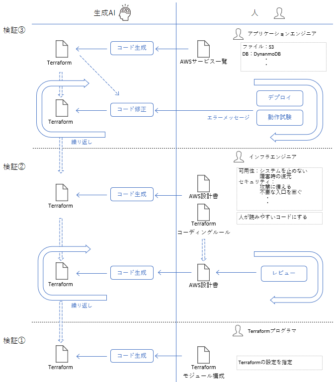

## 2. 報告

## 2.1. 生成AIを用いたシステム開発の全体像

「すべてのコーディングを生成AIが行う」ことを目標とし、開発の各フェーズで生成AIをどう活用すべきかをまとめました。

<!-- 
ここに小林図を挿入
 -->

### 2.1.1. AI基盤モデル、ツールの選定

システム開発に用いる生成AIの基盤モデルと開発ツールを選定する。選定にあたっては次の要素を考慮する。
文献などを当たり、選定の要素の合致する構成を考えた。

### 2.1.1.1. 基盤モデル、選定の要素

**基盤モデル

### 2.1.2. 生成AI活用 プロトタイプ開発

### 2.1.2. 生成AI活用 プロトタイプ開発

ざっくりとしたサービスのプロトタイプがあれば、開発であれば
<!-- 
詳細は別章参照として誘導
プロトタイプ開発における生成AI活用  
「4.1. 生成AI活用 プロトタイプ開発」
 -->

### 2.1.3. 生成AI活用 AWSインフラを含む環境構築
<!-- 
インフラ基盤構築における生成AI活用  
「4.2. 生成AI活用 AWSインフラを含む環境構築」
ここでは以下２つに別れ、
1. AWSインフラ詳細設計書からコードを起こす方法
2. Terraform詳細設計書からコードを起こす方法
コーディングの省略を目指していたのに、設計書の複雑さからコーディングと同等の技術力を求められるため、あまり有用ではない
 -->

## 2.2 開発ドキュメントの重要性
<!-- 
ドキュメントの重要性を記述
弊社のドキュメント軽視文化を軽く指摘
主張：生成AIによる開発プロセスを成功させるために必要なドキュメントの条件を書く
 -->