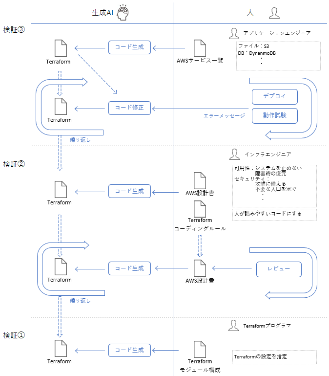

## 2. 報告

## 2.1. 生成AIを用いたシステム開発の全体像

「すべてのコーディングを生成AIが行う」ことを目標とし、開発の各フェーズで生成AIをどう活用すべきかをまとめました。

### 2.1.1. AI基盤モデル、ツールの選定

コーディングを行わせるための生成AI基盤モデルと開発ツールを選定する。

生成AIは急速に進歩している。開発の開始にあたり更新情報を参照し最適な基盤モデル、ツールを選定する。

選定にあたっては基盤モデルの能力を評価するベンチマークなどを参照する。IaCのコーディング能力を評価するためのベンチマークを以下に挙げる。

- DPIaC-Eval ： IaCに特化しコードを生成を測定。精度の高いコードを生成させるための手法についての言及。
- SWE-bench ： 実用レベルのコードを自律生成・修正できる能力を測定。

### 2.1.2. 生成AI活用 プロトタイプ開発

システムのプロトタイプ開発を行い、動作確認を行うための環境をAWS上に作成する。

###### (1) 想定する作業者

- アプリケーションエンジニア
- AWSのサービスについて簡単の知識をもつ

###### (2) 生成AIのインプット

- アプリケーション仕様書
    - 機能概要
    - 技術スタック 開発言語、フレームワーク、データベースなど
- AWSサービス一覧
    - 使用するAWSサービスとシステム上の役割

###### (3) 状況

- ローカルで動作するアプリケーションを作成している。
- AWSシステム構成の検証のため、プロトタイプの動作確認環境をAWS上に作成する。

###### (4) 開発プロセス

- ① 【作業者】ドキュメント「AWSサービス一覧」を作成する
- ② 【作業者】アプリケーションの仕様書と「AWSサービス一覧」同時に入力し、生成AIにTerraformコードの生成を指示する。
- ③ 【生成AI】Terraformコードを生成する。
- ④ 【作業者】生成されたTerraformコードからAWSの環境を作成し、アプリケーションを動作させる。
- ⑤ 【作業者】AWSの環境作成やアプリケーションの動作確認で発生したエラーを入力し、生成AIに修正を指示する。
- ⑥ 【生成AI】エラーの調査を行い、アプリケーションとTerraformのコードを修正する。
- ⑦ 【作業者】エラーがなくなるまで④から⑥を繰り返す。

### 2.1.3. 生成AI活用 AWSインフラを含む環境構築

プロトタイピングで作成したAWSのサービス一覧を参考にしてAWSの設計を行う。

AWSの設計はセキュリティや可用性などシステムの要件を考慮してAWSサービスの構成、設定を決定する。

生成したTerraformコードを作業者が参照する。コードの可読性を挙げるためにコーディングルールに従ったコードを生成させる。

- AWS詳細設計書からTerraformのコードを生成させる。（「2.1.3.1. AWS詳細設計書からコード生成」）
- AWS詳細設計書からTerraformのコードの生成で意図した設定にならない場合のみ、Terraformの詳細設計書を作成する。（「2.1.3.2. AWS詳細設計書からコード生成」）

### 2.1.3.1. AWS詳細設計書からコード生成

###### (1) 想定する作業者

- インフラエンジニア
- システム要件を理解して、AWS詳細設計ができる

###### (2) 生成AIのインプット

- AWS詳細設計書
- Terraformコーディングルール

###### (3) 状況

- プロトタイピングに合格したシステムを動作させる環境を作成する。
- システム要件に従った環境を作成する。
- 社内共通で利用するTerraformのコーディングルールがある。

###### (4) 開発プロセス

- ① 【作業者】ドキュメント「AWS詳細設計書」を作成する
- ② 【作業者】「AWS詳細設計書」「Terraformコーディングルール」を入力し、生成AIにTerraformコードの生成を指示する。
- ③ 【生成AI】Terraformコードを生成する。
- ④ 【作業者】生成されたTerraformコードの検証を行う。検証には次の手法を使用する。
     - コード解析ツールによるチェック
     - 生成AIによるコードレビュー
- ⑤ 【作業者】④の検証結果に従い、「AWS詳細設計書」「Terraformコーディングルール」を修正する。
- ⑥ 【作業者】修正した「AWS詳細設計書」「Terraformコーディングルール」を入力し、生成AIにTerraformコードの生成を指示する。
- ⑦ 【作業者】指摘がなくなるまで③から⑥を繰り返す。
- ⑧ 【作業者】生成されたTerraformコードを使用してAWSの環境を作成する。

### 2.1.3.2. Terraform詳細設計書からコード生成

「2.1.3.1. AWS詳細設計書からコード生成」で作成したAWS環境が「AWS詳細設計書」の通りにならない場合のみ行う。

###### (1) 想定する作業者

- インフラエンジニア
- システム要件を理解して、AWS詳細設計技術を持つ
- Terraformのコーディング技術を持つ

###### (2) 生成AIのインプット

- Terraform詳細設計書
- Terraformコーディングルール

###### (3) 開発プロセス

- ① 【作業者】ドキュメント「Terraform詳細設計書」を作成する
- ② 【作業者】「Terraform詳細設計書」を入力し、生成AIにTerraformコードの生成を指示する。
- ③ 【生成AI】Terraformコードを生成する。
- ④ 【作業者】生成されたTerraformコードの検証を行う。作業者がTerraformコードを目視し、設計書に従っているか確認する。
- ⑤ 【作業者】作業者の意図したコードが生成されるまでコード①から④を繰り返す。

## 2.2 開発ドキュメントの重要性

生成されるコードは「基盤モデル」、「開発ツール」、「生成AIのインプット」になるドキュメントにより決定される。

生成AIは実行する度に異なる結果を出力する。作業者の意図したコードを安定して出力させるためには設計書の記載内容が重要になる。設計書は未決定の項目がなくなるよう詳細に記載する必要がある。

詳細設計書に全ての設定値を記載するとTerraformのコーディンを行う作業量に匹敵する作業量になる。要件と設計の意図を伝えることで安定してコードを出力させるために設計の標準化も重要になる。
