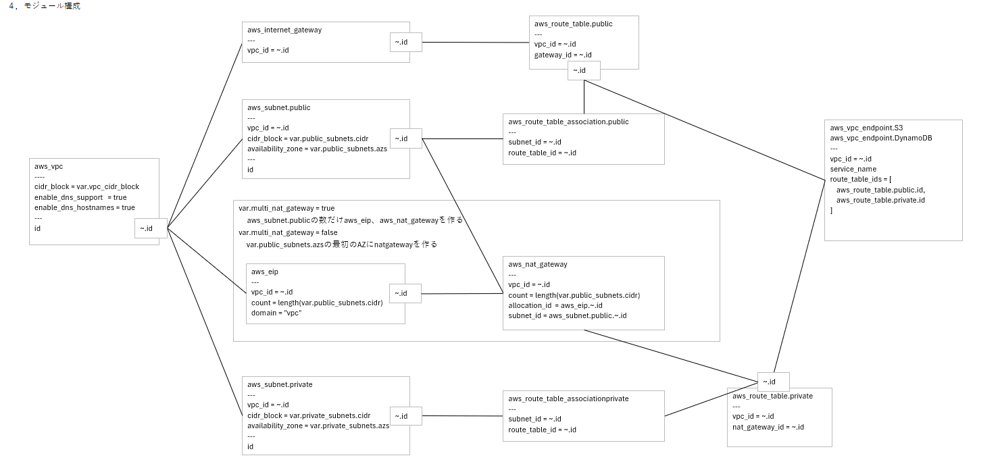

### 4.4. 生成AI活用 Terraform詳細設計からのAWSインフラ構築検証

#### 4.4.1. 経緯

これは、生成AIをTerraformコーディングの省力化手段として活用した最初期の検証です。
本検証の出発点は、Terraformモジュール設計の表現方法の模索にあります。

従来はExcelのオブジェクト図を用いて設計書を作成していたが、オブジェクトの配置や見やすさの調整など、設計本来の目的以外の作業に多くの手間がかかっていました。この課題を解消するため、自動描画が可能な記法の導入を検討し、以下のツールや記法を試行しました。

**試行ツール**
  - Mermaid
  - UML

**試行記法**
  - クラス図
  - ER図
  - オブジェクト図
  - 状態遷移図

しかし、Terraformモジュールの構造や特性を的確に表現できる記法は見つからず、最終的にExcelへ回帰することとなりました。その後、コーディングに必要な情報を過不足なく盛り込むことを重視し、Terraform設計書の内容を精緻化した結果、本ケースにおけるTerraformモジュール設計書の原型が完成しました。

#### 4.4.2. 成果

#### 4.4.3. 課題

**目標**  
生成するたびに、同じAWSインフラ構成のTerraformコードが生成できることを目標としました。

生成するたびにAWSインフラ構成に差異があるようでは、

生成AIにインプットする同一のソースを用いれば、何度生成しても、

AWSインフラ環境を作成できるTerraformコードを生成させることを目的としました。

#### 4.4.4. 結論

独自記法によるTerraformモジュール設計書を生成AIに入力することで、毎回同じAWSインフラコードを高い再現性で生成できることは確認できました。しかし一方で、この手法では設計段階でコーディングと同等の技術力や時間が必要となるため、Terraform技術の省略や開発時間短縮という観点では、従来の開発プロセスに比べて大きな優位性は見出せませんでした。

###### (1) 概要

題材は、以下の一般的なECS（Fargate）の構成。

AWSシステム構成図とTerraformモジュール詳細書をインプットとして、生成AIにコードを生成させる手法です。

独自記法のTerraformモジュール設計書をExcelオブジェクト図で作成し、画像として生成AIにインプットします。生成AIに独自記法の解釈方法を教え込むために「デザインルール」を作成します。

本プロセスは、設計にTerraformコーディングと同等程度の技術と時間が要求されます。そのため、生成AIを用いる本来の目的である「Terraformコーディングの省略」という点で、本プロセスは有用とは言えませんでした。

###### (2) 特徴

本プロセスは、以下にあげる特徴を持ちます。

- **独自記法のTerraform詳細設計書**

- **高い再現性を有するコード生成**  
  本手法では、コーディングルールおよびTerraformモジュール設計を厳格に定義することにより、生成AIによる解釈の曖昧性を排除し、複数回の生成においても同一または高い類似性を有するコードの出力が可能となる。

- **運用に優れたコード**  
  設計書と生成コードの比較を通じて可読性が向上し、生成されたコードの保守性に優れる。

- **設計工程の高度化**  
  本手法の適用にあたっては、AWSおよびTerraformに関する高度な知識と技術が要求される。特に、AWSリソースの適切なモジュール分割やモジュール間の連携設計など、従来のAWS詳細設計に加えてTerraform特有の設計作業が必要となるため、設計フェーズの工数増大および難易度の上昇が認められる。

###### (3) 課題特徴

「高い再現性で同一コードを生成できる」という点で有効でしたが、その実現には高度な専門知識と多大な労力、長い設計時間が必要となるため、現実的な開発プロジェクトにおいてはコストパフォーマンスや運用効率の観点から実用的とは言い難い、という結論に至った。  

今後は、テキストベースでTerraform設計が可能な記法の登場に注視し、より効率的な運用方法への転換を検討する必要がある。

###### (3) 設計書

本プロセスでは、以下の設計書をインプットして生成AIにコーディングを指示します。

- **AWSシステム構成図**  
  従来の手法に準拠して作成し、画像キャプチャとして生成AIにインプットします。  

- **Terraformモジュール設計書**  
  独自記法で作成し、画像キャプチャとして生成AIにインプットします。  
  Terraformによって構築される各種リソースを機能単位でモジュール化し、各リソースの設定値およびリソース間の相関関係を明示的に記述します。

  
  

- **デザインルール**  
  デザインルールは、Terraformモジュール設計書の表記法およびTerraformコードのコーディング規約を体系的に定義するものである。これにより、生成AIに対してモジュール設計書の解釈方法を明示するだけでなく、設計書作成者に対する記述規範としても機能する。具体的には、ディレクトリ構成、コーディング規約、コメント記述ルール等を含み、これらはコーディングルールとして明文化される。なお、これらのルールは複数ファイルに分割して管理することも可能であるが、生成AIへのインプットとする観点から、テキストベースで作成することが求められる。

## 5.3. 制約

この手法では、作成した設計書を画像として生成AIにインプットする。そのため、画像解析が可能なAI基盤モデルを選択することが必須条件である。

###### (4) コード生成手順

本手法におけるコード生成プロセスは、従来のAWSインフラストラクチャ設計書に加え、Terraform固有の設計要素を体系的に組み込むことを特徴とする。具体的には、AWSリソースを機能単位で分割したモジュール設計、各モジュール間の連携を担うインターフェースモジュール設計、ならびにコーディングルールの策定を含む。

本プロセスは以下の手順で構成される。

1. AWSシステム構成図および基本設計書を作成する。
2. Terraformモジュール設計書およびコーディングルールを策定する。
3. 生成AIに対し、Terraformコードの生成を指示する。
4. 生成されたTerraformコードに対し、以下の観点から検証を実施する。
   - コード解析ツールによる静的解析
   - 生成AIによるコードレビュー
   - 作業者によるコードレビュー
   - 開発環境へのデプロイ実行およびデプロイ時のエラー対応
5. 手順4において検出された課題・問題点を、手順2の設計書およびコーディングルールに反映し、設計内容を修正する。
6. 手順4の全ての検証項目に合格するまで、手順3から手順5を反復する。

この一連の手順により、設計情報と生成コードの整合性を高めつつ、高品質かつ再現性の高いTerraformコードの生成を実現する。

## 5.6. 総評

本章では、開発手法①の評価を「メリット」「デメリット」「課題と今後の展望」の3つの観点から整理する。

### 5.6.1. メリット

- **高い再現性と設計意図の反映**  
  Terraformモジュール設計書において、全AWSリソースを網羅的かつ詳細に記述することで、設計意図に忠実なコード生成が可能となった。
- **生成AIによるコードの一貫性**  
  設計書の記載内容やコーディングルールを明確に定義し、設計書と生成コードの対応関係を厳格に管理することで、生成AIによるコード生成のばらつきを抑制し、繰り返し実行しても同一のコードが得られることを実証した。
- **依存関係の可視化と理解促進**  
  リソース間の相関関係を図示することで、依存構造の可視化や設計内容の理解促進にも寄与した。

### 5.6.2. デメリット

- **高い専門知識と労力の要求**  
  Terraformモジュール設計書の作成には、Terraformコーディングと同等、あるいはそれ以上の高度な専門知識と経験が必要となる。AWSのシステム構成や各リソースの詳細な設定、リソース間の相関関係を正確に記述する必要があり、設計書の粒度や記載ルールの統一、記述ミスの防止など、従来のコーディング作業と同等の注意深さと労力が求められる。

- **設計書作成・修正の負担増**  
  設計書の作成・修正に多くの時間を要し、設計内容の変更や追加要件への対応時には、設計書とコードの整合性を維持するための追加作業が発生し、開発全体の効率が低下する傾向が見られた。

- **独自記法による運用上の課題**  
  Terraformリソース設計をテキストベースで表現するために既存のER図やUMLなどを検討したが、十分な表現ができず独自記法を採用せざるを得なかった。その結果、Excelの画像をインプットとする運用となり、テキストデータと比較して変更差分の確認が困難、設計書の記載内容が複雑化しやすい、独自記法のため未経験リソースの記載方法を自ら開拓する必要がある、といったデメリットが生じた。
  
- **可読性・保守性・チーム開発での課題**  
  設計書の可読性や保守性、バージョン管理・差分確認の煩雑さ、チーム開発における情報共有やレビューの負担増加も課題として挙げられる。

### 5.6.3. 課題と今後の展望

以上より、開発手法①は
