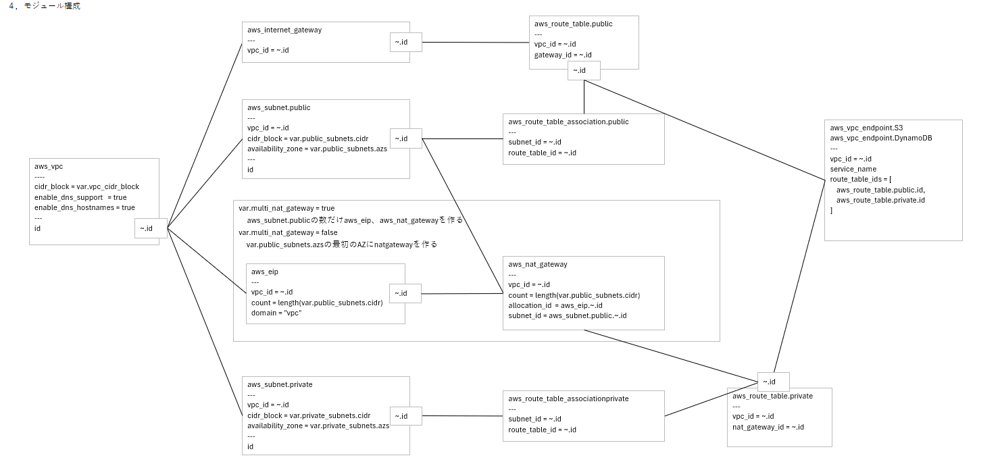

## x.x ケース① Terraformモジュール詳細設計書からのコード生成

### x.x.1. 概要

本ケースでは、Terraformの十分な専門知識を有する技術者がTerraformモジュールの詳細設計を作成し、その設計情報を基に生成AIにコード生成を委ねる。

このケースでは、設計書を画像として生成AIにインプットするため、画像解析が可能なAI基盤モデルを選択することが必須となる。

### x.x.2. インプット

本ケースでは、以下にあげるものを生成AIへのインプットとする。

- **AWSシステム構成図**  
  従来のExcel画像フォーマットに準拠して作成する。
  
  画像キャプチャを生成AIへのインプットとする。

- **Terraformモジュール設計書**  
  独自記法で作成

  Terraformによって構築される各種リソースを機能単位でモジュール化し、各リソースの設定値およびリソース間の相関関係を明示的に記述する。
  
  画像キャプチャを生成AIへのインプットとする。

  

- **Terraformデザインルール**  
  Terraformモジュール設計書の表記法、およびTerraformコードのコーディングルールを定義する。
  
  生成AIに対してモジュール設計書の解釈方法を明示するとともに、設計書作成者に対する記述規範としても機能する。具体的には、ディレクトリ構成、コーディング規約、コメント記述ルール等を含み、これらはコーディングルールとして明文化される。これらのルールは複数ファイルに分割して管理することも可能であるが、生成AIへのインプットとする観点から、テキストベースで作成することが求められる。
  
### x.x.3.  コード生成手順

一度のコード生成指示でデプロイ可能なコードが生成されることを目的とする。

生成されたコードに問題があった場合は生成AIと改善方法を模索し、設計書を修正し、コードを全削除した後、再度コードを生成させる。この手順を、一度のコード生成指示で完成品のコードが生成されるまで繰り返す。

1. 生成AIにコード生成を指示  
    ```
    プロンプト
      設計図をもとに、ルールに従ってTerraformコードを生成してください。  
    
    　　インプット1: AWSシステム構成図の画面キャプチャ
    　　インプット2: Terraformモジュール設計書の画面キャプチャ
    　　インプット3: Terraformデザインルール
   ```

2. 生成されたTerraformコードの検証を指示
    ```
    プロンプト
      設計図とコードを比較し、セルフレビューしてください。
    　解釈が一意に定まらない場合、自己判断せずに私に質問してください。
   ```

3. 手順2において検出された指摘事項および提案された修正案をもとにコード修正

4. terraform plan（dry run）を実行

5. 問題なく通れば、手順2で受け入れた修正を設計書に反映

6. コードをすべて削除

7. 指摘事項がなくなるまで手順1～手順6を繰り返し実行

### x.x.4. 生成されたコードの品質

設計書の欠陥がそのままコードに反映されるため、生成されたコードと設計書の品質が比例する。

生成AIによる繰り返しのセルフレビューにより設計書とコード品質の向上を両立できる。設計の曖昧さを排除できるため、最終的に完成する設計書から生成されるコードは品質が高く、再現性も高いものとなる。設計者が意図していかった欠陥も指摘されるため、結果としてAWSインフラ自体の品質も向上する。

### x.x.5. 問題

1. ハルシネーション  
  Terraformの記法上実現できない設計仕様を与えると、生成AIはそれを指摘すること無くコーディングする。そのため、terraform planを実行するまではコードの問題に気づくことができない。  
  例えば、パラメータファイルでサブネットの値を/24～/26のいずれかが与えられるので、その時指定された値によって作成するサブネット値を変更するような仕様は実現できないが、生成AIはコーディングし、terraform plan時にエラーが発生する。  

### x.x.6. 所感

Terraformの高い専門知識が必要であり、実際に手動でコーディングするのと大差ない設計時間が必要になる。生成AIで短縮されるコーディング時間が、そのまま設計書のコードと品質向上に消費されるイメージで、開発時間短縮という点では利点がない。

